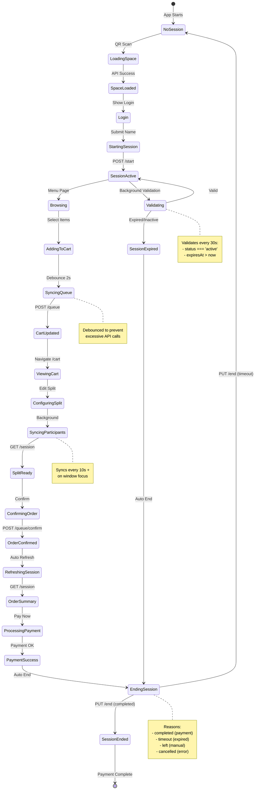

# Complete System Flow with API Integration

## Comprehensive Application Flow with All APIs

```mermaid
sequenceDiagram
    participant U as User
    participant L as Landing/Login
    participant SC as SessionContext
    participant M as Menu Page
    participant CC as CartContext
    participant C as Cart Page
    participant SpC as SplitContext
    participant OS as Order Summary
    participant API as Backend API

    Note over U,API: 1. SESSION INITIALIZATION

    U->>L: Scans QR Code with spaceId
    L->>API: GET /ordering-session/space/{spaceId}
    API-->>L: Space, Business, Session data
    L->>SC: Store session data in context + localStorage

    U->>L: Enter name & dining type
    L->>API: POST /ordering-session/start<br/>{spaceId, guestName, patronId?}
    API-->>L: Session created with sessionUserId
    L->>SC: Update session with active session
    L->>L: Store sessionUserId in localStorage
    L->>M: Navigate to /menu

    Note over U,API: 2. SESSION VALIDATION (Background)

    loop Every 30 seconds + On window focus
        M->>SC: validateSession()
        SC->>SC: Check status === 'active'
        SC->>SC: Check expiresAt > now

        alt Session Invalid/Expired
            SC->>API: PUT /session/{sessionId}/end<br/>{sessionUserId, reason: 'timeout'}
            API-->>SC: Session ended
            SC->>SC: clearSession()
            SC->>L: Redirect to /login
        end
    end

    Note over U,API: 3. MENU BROWSING

    M->>API: GET /business/menus/active/{businessId}
    API-->>M: Menu with categories
    M->>API: GET /items/business/{businessId}
    API-->>M: All menu items with details

    U->>M: Browse categories & items
    U->>M: Select item, customize
    M->>CC: addItem(item, customizations, quantity)
    CC->>CC: Update cart state
    CC->>CC: Save to localStorage

    Note over CC: Debounced Queue Sync (2s delay)

    CC->>API: POST /session/{sessionId}/queue<br/>{sessionUserId, items: [{itemId, quantity}]}
    API-->>CC: Queue updated successfully

    Note over U,API: 4. CART MANAGEMENT

    U->>C: Navigate to /cart
    C->>CC: Load cart from context
    C->>SpC: Load split settings

    Note over C,SpC: Participant Sync (Every 10s + On focus)

    loop Periodic Participant Sync
        SpC->>API: GET /session/{sessionId}
        API-->>SpC: Session with participants[]
        SpC->>SpC: Sync participants to split
        SpC->>SpC: Sort: Current user first
    end

    U->>C: Modify quantities
    C->>CC: updateQuantity(itemId, quantity)
    CC->>API: POST /session/{sessionId}/queue<br/>(Updated items)
    API-->>CC: Queue synced

    U->>C: Configure split settings
    C->>SpC: setSplitMode(mode)
    SpC->>SpC: calculateSplit()

    alt Split Mode: Even
        SpC->>SpC: total / participantCount
    else Split Mode: Self
        SpC->>SpC: Current user = $0, others split
    else Split Mode: All
        SpC->>SpC: Current user = total, others = $0
    else Split Mode: Custom
        SpC->>SpC: Use custom shares
    end

    SpC->>SpC: Validate: Sum = Total?
    SpC->>SpC: Save to localStorage

    Note over U,API: 5. ORDER CONFIRMATION

    U->>C: Click "Confirm Order"
    C->>CC: confirmOrder(paymentType)
    CC->>SC: Validate session

    CC->>API: POST /session/{sessionId}/queue/confirm<br/>{sessionUserId, paymentType}
    API-->>CC: {orderId, status, total, items[]}

    Note over CC: ✅ Order confirmed successfully

    CC->>SC: refreshSessionData()
    SC->>API: GET /session/{sessionId}
    API-->>SC: {session, orders[], participants[]}
    SC->>SC: Update orders[] array
    SC->>SC: Update participants
    SC->>SC: Save to localStorage

    Note over SC: ✅ Session data refreshed

    CC->>CC: clearCart()
    CC->>OS: Navigate to /order-summary

    Note over U,API: 6. ORDER SUMMARY & PAYMENT

    OS->>OS: Display order details
    OS->>SpC: Load split configuration
    OS->>OS: Calculate user's share

    U->>OS: Click "Pay now"
    OS->>OS: Simulate payment (500ms)

    Note over OS: Payment Successful

    OS->>SC: endSession('completed')
    SC->>API: PUT /session/{sessionId}/end<br/>{sessionUserId, reason: 'completed'}
    API-->>SC: Session ended successfully
    SC->>SC: clearSession()
    SC->>SC: Clear localStorage

    Note over SC: ✅ Session ended after payment

    OS->>OS: Show PaymentModal
    U->>OS: Click "Start New Order"
    OS->>OS: Clear all state
    OS->>M: Navigate to /menu

    Note over U,API: 7. SESSION ENDING SCENARIOS

    alt Scenario 1: Payment Complete
        OS->>API: PUT /session/{sessionId}/end<br/>reason: 'completed'
    else Scenario 2: Session Timeout
        SC->>API: PUT /session/{sessionId}/end<br/>reason: 'timeout'
    else Scenario 3: User Leaves
        U->>API: PUT /session/{sessionId}/end<br/>reason: 'left'
    else Scenario 4: Cancelled
        U->>API: PUT /session/{sessionId}/end<br/>reason: 'cancelled'
    end

    API-->>SC: Session ended
    SC->>SC: Clear all local data
    SC->>L: Redirect to login (if needed)
```



## API Endpoints Summary

### 📍 Session Management APIs

| Method | Endpoint | Purpose | Request Body | Response |
|--------|----------|---------|--------------|----------|
| **GET** | `/ordering-session/space/{spaceId}` | Get space & business data | - | `{space, business, session?, participantsCount}` |
| **POST** | `/ordering-session/start` | Start new session | `{spaceId, guestName, patronId?}` | `{id, participants[], status, expiresAt}` |
| **GET** | `/ordering-session/session/{sessionId}` | Get session details | - | `{id, participants[], orders[], orderQueue[]}` |
| **PUT** | `/ordering-session/session/{sessionId}/end` | End active session | `{sessionUserId, reason?}` | `{message, session: {id, status, endedAt}}` |

### 🍔 Menu APIs

| Method | Endpoint | Purpose | Request Body | Response |
|--------|----------|---------|--------------|----------|
| **GET** | `/business/menus/active/{businessId}` | Get active menu | - | `{menu with categories}` |
| **GET** | `/items/business/{businessId}` | Get all menu items | - | `{items[]}` |

### 🛒 Queue & Order APIs

| Method | Endpoint | Purpose | Request Body | Response |
|--------|----------|---------|--------------|----------|
| **POST** | `/ordering-session/session/{sessionId}/queue` | Update customer queue | `{sessionUserId, items: [{itemId, quantity}]}` | `{message, queue: {items[], updatedAt}}` |
| **POST** | `/ordering-session/session/{sessionId}/queue/confirm` | Confirm order | `{sessionUserId, paymentType}` | `{id, items[], total, status, payment}` |

## Data Flow Architecture

```mermaid
graph TB
    subgraph Client["🖥️ Frontend"]
        subgraph Pages["📄 Pages"]
            P1[Landing Page]
            P2[Login Page]
            P3[Menu Page]
            P4[Cart Page]
            P5[Order Summary]
        end

        subgraph Contexts["⚡ React Contexts"]
            C1[SessionContext<br/>- sessionData<br/>- validateSession<br/>- refreshSessionData<br/>- endSession]
            C2[CartContext<br/>- cart<br/>- addItem<br/>- confirmOrder<br/>- syncQueue]
            C3[SplitContext<br/>- split<br/>- calculateSplit<br/>- participants<br/>- syncParticipants]
        end

        subgraph Hooks["🎣 Custom Hooks"]
            H1[useSessionValidation<br/>Auto-validate every 30s]
            H2[useParticipantSync<br/>Sync every 10s]
        end

        subgraph Storage["💾 Local Storage"]
            S1[morsel_session_data]
            S2[morsel_session_user_id]
            S3[morsel_cart]
            S4[morsel_split]
        end
    end

    subgraph Backend["🌐 Backend API"]
        A1[Session APIs<br/>GET space/{id}<br/>POST start<br/>GET session/{id}<br/>PUT session/{id}/end]
        A2[Menu APIs<br/>GET menus/active/{id}<br/>GET items/business/{id}]
        A3[Queue APIs<br/>POST queue<br/>POST queue/confirm]
    end

    P1 --> A1
    P2 --> C1
    C1 --> A1
    P2 --> P3

    P3 --> C2
    P3 --> A2
    C2 --> A3

    P4 --> C2
    P4 --> C3
    C3 --> A1

    P5 --> C1
    P5 --> C2
    P5 --> C3

    H1 --> C1
    H2 --> C3

    P3 --> H1
    P4 --> H1
    P5 --> H1

    C1 --> S1
    C1 --> S2
    C2 --> S3
    C3 --> S4

    style C1 fill:#cce5ff
    style C2 fill:#cce5ff
    style C3 fill:#cce5ff
    style A1 fill:#ffeb99
    style A2 fill:#ffeb99
    style A3 fill:#ffeb99
```

## Complete Feature Matrix

| Feature | Component | Context | API Used | Frequency |
|---------|-----------|---------|----------|-----------|
| **QR Code Scan** | Landing | SessionContext | GET /space/{id} | Once |
| **Start Session** | Login | SessionContext | POST /start | Once per session |
| **Session Validation** | All protected pages | SessionContext | - | Every 30s + on focus |
| **Session Refresh** | After order confirm | SessionContext | GET /session/{id} | After order |
| **Session End** | Order Summary / Validation | SessionContext | PUT /session/{id}/end | On payment / expiry |
| **Load Menu** | Menu | - | GET /menus/active/{id} | Once |
| **Load Items** | Menu | - | GET /items/business/{id} | Once |
| **Add to Cart** | Menu | CartContext | - | Per item |
| **Queue Sync** | Auto (debounced) | CartContext | POST /queue | Every cart change (2s debounce) |
| **Participant Sync** | Cart/Split Modal | SplitContext | GET /session/{id} | Every 10s + on focus |
| **Calculate Split** | Cart/Split Modal | SplitContext | - | On split change |
| **Confirm Order** | Cart | CartContext | POST /queue/confirm | Once per order |
| **Payment** | Order Summary | SessionContext | PUT /session/{id}/end | On payment success |

## State Management Flow



## Performance Optimizations

### 🚀 API Call Optimizations

1. **Session Validation**:
   - Debounced with 5s minimum gap
   - Only validates if not loading
   - Skips redundant checks

2. **Queue Sync**:
   - 2-second debounce on cart changes
   - Prevents API spam during rapid edits

3. **Participant Sync**:
   - 10-second interval
   - Only when window focused
   - Caches for performance

4. **Session Refresh**:
   - Only after critical operations (order confirm)
   - Graceful failure handling

### 💾 Storage Strategy

- **localStorage**: Persistent session, cart, split data
- **React Context**: In-memory state for real-time updates
- **Sync on mount**: Hydrate from localStorage
- **Sync on change**: Auto-save to localStorage

### ⚡ React Optimizations

- **useCallback**: All validation/sync functions
- **useMemo**: Context value objects
- **Debouncing**: Cart sync, validation checks
- **Lazy validation**: Skip when loading

---

## Summary

This diagram shows the complete system flow including:

✅ **7 API Endpoints** across Session, Menu, and Queue management
✅ **3 React Contexts** for state management
✅ **2 Custom Hooks** for background sync
✅ **5 Main Pages** in the user journey
✅ **4 Session End Scenarios** with proper cleanup
✅ **Multiple Optimization Strategies** for performance

All flows maintain data consistency, handle errors gracefully, and optimize for performance with debouncing, caching, and smart validation.
