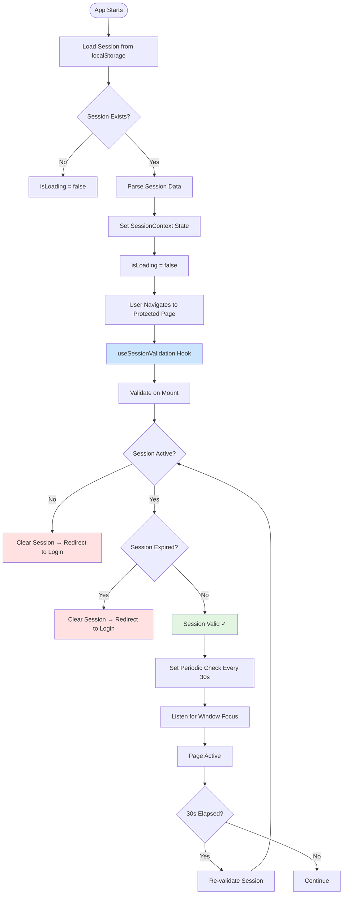
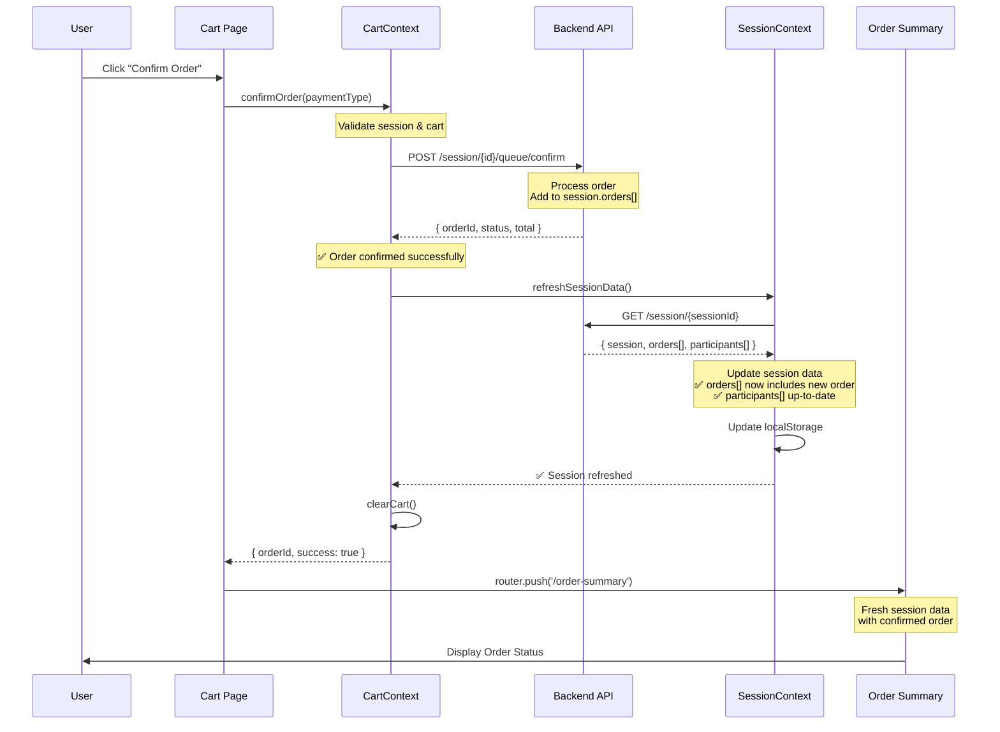
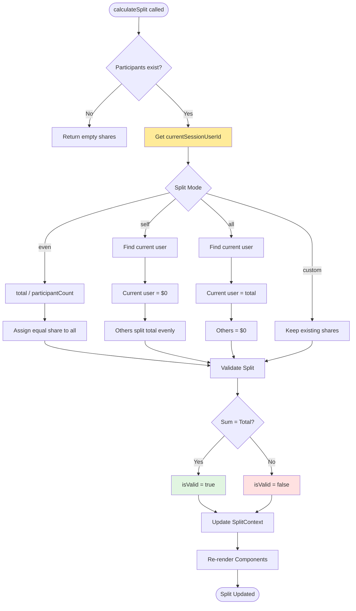
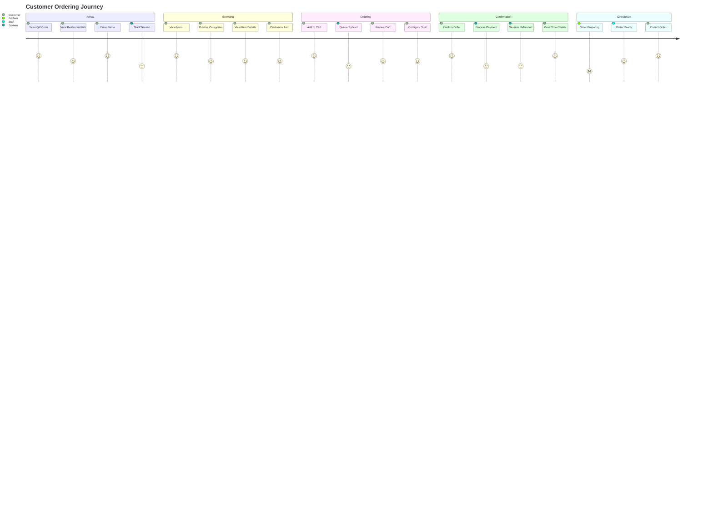
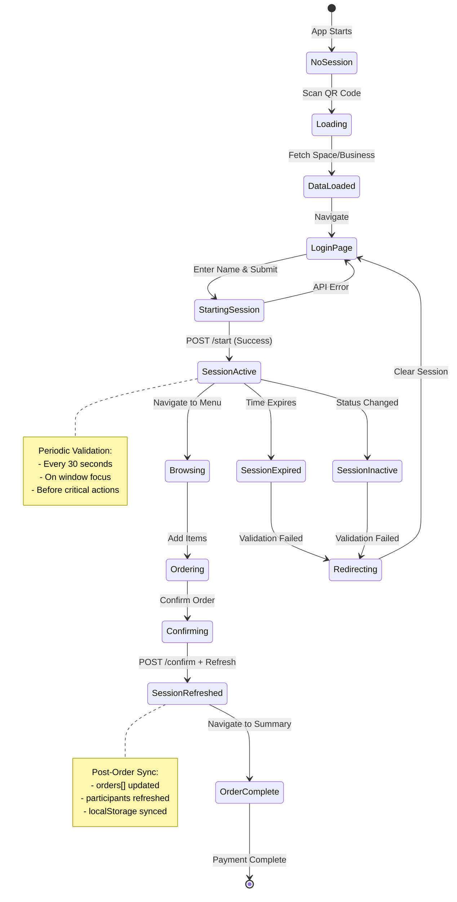

# Morsel Customer App - Complete Flow Diagrams

## 1. Overall Application Flow

```mermaid
flowchart TD
    Start([User Scans QR Code]) --> Landing[Landing Page]
    Landing --> FetchSpace[Fetch Space & Business Data]
    FetchSpace --> StoreSession[Store Session Data in Context]
    StoreSession --> Login[Login Page]

    Login --> EnterName[User Enters Name & Dining Type]
    EnterName --> StartSession[POST /ordering-session/start]
    StartSession --> StoreUserId[Store sessionUserId from API]
    StoreUserId --> UpdateContext[Update SessionContext]
    UpdateContext --> Menu[Menu Page]

    Menu --> BrowseMenu[Browse Categories & Items]
    BrowseMenu --> AddItem[Add Item to Cart]
    AddItem --> QueueSync[Auto-sync Queue to API]
    QueueSync --> Cart[Cart Page]

    Cart --> ViewSplit[View Split Settings]
    ViewSplit --> ConfigureSplit[Configure Split Mode]
    ConfigureSplit --> ConfirmOrder[Confirm Order & Payment]
    ConfirmOrder --> OrderAPI[POST /queue/confirm]
    OrderAPI --> RefreshSession[Refresh Session Data]
    RefreshSession --> VerifyOrder[Verify Order in Session]
    VerifyOrder --> OrderSummary[Order Summary Page]

    OrderSummary --> Payment[Payment Flow]
    Payment --> Complete([Order Complete])

    style Start fill:#e1f5e1
    style Complete fill:#e1f5e1
    style OrderAPI fill:#ffeb99
    style RefreshSession fill:#ffeb99
    style VerifyOrder fill:#ffeb99
```



## 2. Session Management & Validation Flow



## 3. Order Confirmation & Session Sync Flow



## 4. Cart & Queue Management Flow

```mermaid
flowchart TD
    Menu[Menu Page] --> AddToCart[Add Item to Cart]
    AddToCart --> UpdateCartState[Update CartContext State]
    UpdateCartState --> SaveLocal[Save to localStorage]
    SaveLocal --> CheckDebounce{Debounce Check}

    CheckDebounce -->|Within 2s| Skip[Skip Sync]
    CheckDebounce -->|After 2s| SyncQueue[Sync Queue to API]

    SyncQueue --> BuildPayload[Build QueueItem[]]
    BuildPayload --> PostQueue[POST /session/{id}/queue]
    PostQueue --> UpdateLastSync[Update lastQueueSync timestamp]
    UpdateLastSync --> CartPage[Navigate to Cart]

    CartPage --> ViewItems[View Cart Items]
    ViewItems --> ModifyQuantity{Modify Quantity?}

    ModifyQuantity -->|Yes| UpdateQuantity[Update Quantity]
    UpdateQuantity --> RecalcTotal[Recalculate Total]
    RecalcTotal --> SyncQueue

    ModifyQuantity -->|No| SplitConfig[Configure Split]
    SplitConfig --> SplitMode{Split Mode}

    SplitMode -->|Even| EvenSplit[Split Evenly]
    SplitMode -->|Custom| CustomSplit[Custom Amounts]
    SplitMode -->|All| PayAll[Pay for Everyone]
    SplitMode -->|Self| PaySelf[Others Pay]

    EvenSplit --> Calculate[Calculate Split]
    CustomSplit --> Calculate
    PayAll --> Calculate
    PaySelf --> Calculate

    Calculate --> DisplayAmounts[Display Split Amounts]
    DisplayAmounts --> ConfirmBtn[Confirm Order Button]

    ConfirmBtn --> ConfirmFlow[Order Confirmation Flow]

    style SyncQueue fill:#ffeb99
    style PostQueue fill:#ffeb99
    style ConfirmFlow fill:#cce5ff
```

## 5. Split Bill Calculation Flow



## 6. Participant Sync Flow

```mermaid
flowchart TD
    Start([Component Mounts]) --> GetSessionId[Get sessionId from SessionContext]
    GetSessionId --> CheckCache{Cache Valid?}

    CheckCache -->|Yes| UseCache[Use Cached Data]
    CheckCache -->|No| FetchAPI[GET /session/{sessionId}]

    FetchAPI --> UpdateCache[Update Cache]
    UpdateCache --> ParseParticipants[Parse API Participants]
    UseCache --> ParseParticipants

    ParseParticipants --> SyncLoop{For Each Participant}

    SyncLoop --> CheckExists{Exists in Split?}
    CheckExists -->|Yes| NextParticipant[Next Participant]
    CheckExists -->|No| AddToSplit[Add to SplitContext]

    AddToSplit --> CreateParticipant[Create Participant Object]
    CreateParticipant --> SetMockFalse[isMock = false]
    SetMockFalse --> AddParticipant[addParticipant]

    AddParticipant --> NextParticipant
    NextParticipant --> SyncLoop

    SyncLoop -->|Done| SortList[Sort: Current User First]
    SortList --> Display[Display Participants]

    Display --> SetInterval[Set Refresh Interval 10s]
    SetInterval --> WindowFocus[Listen Window Focus]

    WindowFocus --> Wait{User Returns?}
    Wait -->|Yes| ForceRefresh[Force Refresh]
    Wait -->|No| IntervalCheck{10s Elapsed?}

    ForceRefresh --> FetchAPI
    IntervalCheck -->|Yes| FetchAPI
    IntervalCheck -->|No| Wait

    style AddToSplit fill:#cce5ff
    style SortList fill:#ffeb99
    style ForceRefresh fill:#ffeb99
```

## 7. Complete User Journey



## 8. Data Flow Architecture

```mermaid
graph TB
    subgraph Client["🖥️ Client Side"]
        subgraph Pages["Pages"]
            Login[Login Page]
            Menu[Menu Page]
            Cart[Cart Page]
            Summary[Order Summary]
        end

        subgraph Contexts["⚡ React Contexts"]
            SessionCtx[SessionContext<br/>- sessionData<br/>- validateSession<br/>- refreshSessionData]
            CartCtx[CartContext<br/>- cart<br/>- addItem<br/>- confirmOrder]
            SplitCtx[SplitContext<br/>- split<br/>- calculateSplit<br/>- participants]
        end

        subgraph Storage["💾 Storage"]
            LocalStorage[localStorage<br/>- session_data<br/>- cart<br/>- split]
        end
    end

    subgraph API["🌐 Backend API"]
        SessionAPI[/ordering-session/<br/>- GET space/{id}<br/>- POST start<br/>- GET session/{id}]
        QueueAPI[/queue/<br/>- POST update<br/>- POST confirm]
        MenuAPI[/menu/<br/>- GET items]
    end

    Login --> SessionCtx
    SessionCtx --> SessionAPI
    SessionAPI --> SessionCtx

    Menu --> CartCtx
    CartCtx --> QueueAPI
    QueueAPI --> CartCtx

    Cart --> SplitCtx
    Cart --> CartCtx
    CartCtx --> QueueAPI

    SessionCtx --> LocalStorage
    CartCtx --> LocalStorage
    SplitCtx --> LocalStorage

    Summary --> SessionCtx
    Summary --> CartCtx

    style SessionCtx fill:#cce5ff
    style CartCtx fill:#cce5ff
    style SplitCtx fill:#cce5ff
    style SessionAPI fill:#ffeb99
    style QueueAPI fill:#ffeb99
```

## 9. Session Lifecycle



## 10. Error Handling Flow

```mermaid
flowchart TD
    Operation([Any Operation]) --> TryCatch{Try Block}

    TryCatch -->|Success| Success[Operation Complete]
    TryCatch -->|Error| CatchError[Catch Error]

    CatchError --> LogError[Console.error with context]
    LogError --> CheckCritical{Critical Operation?}

    CheckCritical -->|Yes| ThrowError[Throw Error]
    CheckCritical -->|No| GracefulFail[Graceful Degradation]

    ThrowError --> UserMessage[Show User Error Message]
    UserMessage --> ErrorState[Error State]

    GracefulFail --> LogWarning[Console.warn]
    LogWarning --> ContinueFlow[Continue Flow]

    Success --> End([Complete])
    ErrorState --> End
    ContinueFlow --> End

    style Success fill:#e1f5e1
    style ErrorState fill:#ffe1e1
    style GracefulFail fill:#fff4cc

    note right of GracefulFail
        Examples:
        - Session refresh fails
        - Queue sync fails
        - Participant fetch fails
        App continues normally
    end note

    note right of ThrowError
        Examples:
        - Order confirmation fails
        - Session not found
        - Invalid payment
        Must notify user
    end note
```

---

## Summary

These diagrams show:

1. **Overall Application Flow**: Complete user journey from QR scan to order completion
2. **Session Management**: How sessions are validated, expired, and refreshed
3. **Order Confirmation**: Detailed sequence of order processing and session sync
4. **Cart & Queue**: How cart updates trigger API syncs
5. **Split Calculation**: Logic for different split modes
6. **Participant Sync**: Real-time participant management
7. **User Journey**: Customer experience timeline
8. **Data Architecture**: How components, contexts, and APIs interact
9. **Session Lifecycle**: State transitions throughout the session
10. **Error Handling**: How errors are caught and handled gracefully

### Key Integration Points:

- ✅ **Session Validation**: Runs on every protected page
- ✅ **Queue Sync**: Debounced cart updates (2s)
- ✅ **Participant Sync**: Periodic refresh (10s) + on focus
- ✅ **Order Sync**: Immediate after confirmation
- ✅ **Split Calculation**: Triggered on cart/participant changes
- ✅ **Error Handling**: Graceful degradation for non-critical operations

All flows are optimized for performance and maintain data consistency across the application.
