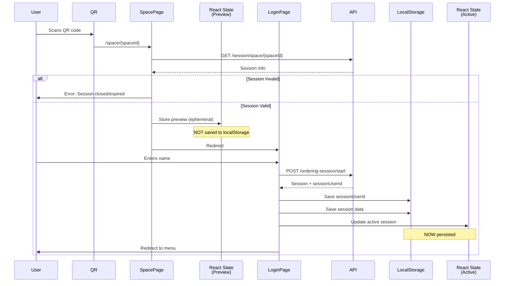

# Session Architecture - Corrected Implementation

## Overview

This document explains the **corrected session management architecture** that properly separates preview sessions (ephemeral) from active sessions (persistent), preventing stale data and localStorage pollution.

---

## The Problem (Before)

### Previous Flow:
```
1. QR Scan → /space/{spaceId}
   ├─ GET /ordering-session/space/{spaceId}
   └─ ✅ IMMEDIATELY SAVES TO localStorage ❌

2. Redirect → /login
   ├─ User enters name
   └─ POST /ordering-session/start

3. → /menu
```

### Issues:
1. **Stale Data**: Session saved before user actually joins
2. **Storage Pollution**: Every QR scan = localStorage entry (even abandoned scans)
3. **Shared Device Issues**: Next user sees previous user's session
4. **Cart Sync Confusion**: Cart starts syncing before user is participant

---

## The Solution (After)

### Corrected Flow:
```
1. QR Scan → /space/{spaceId}
   ├─ GET /ordering-session/space/{spaceId}
   ├─ Validate session exists and is active
   └─ ✅ Store in React state ONLY (preview session)

2. Redirect → /login
   ├─ User enters name
   ├─ POST /ordering-session/start (joins or creates session)
   ├─ Extract sessionUserId from participants
   └─ ✅ NOW save to localStorage (user is confirmed participant)

3. → /menu
   ├─ Cart sync starts (user has valid sessionUserId)
   └─ Firebase/polling sync works correctly
```

---

## Key Architectural Changes

### 1. SessionContext: Dual State Management

**Two separate states:**

```typescript
interface SessionState {
  // Preview session - ephemeral (React state only, NOT persisted)
  previewSession: OrderingSessionData | null;
  setPreviewSession: (data: OrderingSessionData | null) => void;

  // Active session - persistent (localStorage + React state)
  sessionData: OrderingSessionData | null;
  setSessionData: (data: OrderingSessionData) => void;
}
```

**Why:**
- **Preview**: User scanned QR, viewing session details (can refresh and it's gone - that's OK!)
- **Active**: User joined as participant, has sessionUserId (persists across refreshes)

### 2. Space Page: Preview Only

**Before:**
```typescript
// ❌ Bad: Saves immediately to localStorage
setSessionData(response.data);
```

**After:**
```typescript
// ✅ Good: Validates session, then stores as preview (ephemeral)
if (!response.data.session) {
  setError('No active ordering session found for this space.');
  return;
}

if (response.data.session.status !== 'active') {
  setError(`This ordering session is ${response.data.session.status}.`);
  return;
}

// Store as preview only (NOT saved to localStorage)
setPreviewSession(response.data);
```

**Benefits:**
- Validates session exists and is active BEFORE committing user
- No localStorage pollution from abandoned scans
- Clear error messages if session is closed/expired

### 3. Login Page: Join Then Persist

**Before:**
```typescript
// ❌ Bad: Used potentially stale sessionData from localStorage
if (sessionData?.space?.id) {
  const sessionResponse = await sessionService.startSession({
    spaceId: sessionData.space.id,
    guestName: sanitizedName,
  });
  // ... saves everything
}
```

**After:**
```typescript
// ✅ Good: Uses fresh preview session from QR scan
if (!previewSession?.space?.id) {
  throw new Error('No session preview available. Please scan the QR code again.');
}

// Call /start endpoint (joins existing OR creates new)
const sessionResponse = await sessionService.startSession({
  spaceId: previewSession.space.id,
  guestName: sanitizedName,
});

// Extract sessionUserId (CRITICAL for cart sync)
const currentUser = sessionResponse.data.participants.find(
  (p) => p.guestName === sanitizedName
);

if (!currentUser) {
  throw new Error('Failed to join session - participant not found');
}

// ✅ NOW save to localStorage (user is confirmed participant)
setInStorage('morsel_session_user_id', currentUser.sessionUserId);
setSessionData({
  ...previewSession,
  session: sessionResponse.data,
});
```

**Benefits:**
- Only saves after successful join with confirmed sessionUserId
- Uses fresh preview data, not potentially stale localStorage
- Fails gracefully if join fails (doesn't save partial data)

### 4. Automatic Stale Data Cleanup

**On app mount:**
```typescript
useEffect(() => {
  const stored = localStorage.getItem(STORAGE_KEY);
  const storedUserId = localStorage.getItem(STORAGE_KEY_USER_ID);

  if (stored && !storedUserId) {
    // Session without userId = user scanned but never joined
    console.warn('Clearing stale session data (no sessionUserId found)');
    localStorage.removeItem(STORAGE_KEY);
    setSessionDataState(null);
  } else if (stored && storedUserId) {
    // Valid session with userId - load it
    setSessionDataState(JSON.parse(stored));
  }
}, []);
```

**Benefits:**
- Cleans up abandoned sessions automatically
- Prevents shared device issues
- Ensures localStorage only contains valid sessions

---

## Understanding the API

### Key Endpoint: `POST /ordering-session/start`

This endpoint is **smart** and handles both cases:

1. **Existing Active Session**: Joins the user to existing session
2. **No Active Session**: Creates a new session and adds user

```typescript
// Request
{
  spaceId: "table-7",
  guestName: "Alice"
}

// Response
{
  id: "session-123",
  status: "active",
  participants: [
    { sessionUserId: "user-A-abc", guestName: "Alice" }, // ← Extract this!
    { sessionUserId: "user-B-def", guestName: "Bob" }
  ],
  orders: [...],
  expiresAt: "2026-01-09T12:00:00Z"
}
```

**Critical:** The `sessionUserId` comes from the API, not generated client-side!

---

## Data Flow Diagram



---

## Validation Checkpoints

### Checkpoint 1: Space Page (Before Login)
- ✅ Session exists?
- ✅ Session status = "active"?
- ✅ Store as preview (not persisted)

### Checkpoint 2: Login Page (After Name Entry)
- ✅ Preview session available?
- ✅ Call API to join session
- ✅ Extract sessionUserId from response
- ✅ Verify user in participants array
- ✅ NOW save to localStorage

### Checkpoint 3: App Mount (Every Load)
- ✅ Session in localStorage?
- ✅ SessionUserId in localStorage?
- ✅ If session but no userId → Clear stale data
- ✅ If both present → Load active session

---

## Why This Architecture is Correct

### 1. **Better UX**
- User sees restaurant/table info before committing
- Clear error messages if session is invalid
- No confusion about "why can't I order?"

### 2. **Data Integrity**
- Only persists after user successfully joins
- No stale data from abandoned scans
- Clear separation: browsing vs participating

### 3. **Cart Sync Works Correctly**
- Cart only syncs when user has valid sessionUserId
- Firebase/polling only activates for actual participants
- No wasted API calls for non-participants

### 4. **Shared Device Friendly**
- Abandoned previews don't pollute localStorage
- Next user won't see previous user's session
- Automatic cleanup prevents confusion

### 5. **Matches API Design**
- `/space/{spaceId}` = Preview (read-only)
- `/start` = Join (creates participation)
- API-provided sessionUserId is authoritative

---

## Testing the Flow

### Test Case 1: Happy Path
1. ✅ Scan QR → See restaurant name/table
2. ✅ Enter name → Successfully join session
3. ✅ localStorage has session + sessionUserId
4. ✅ Cart sync starts working
5. ✅ Refresh page → Session still loaded

### Test Case 2: Abandoned Scan
1. ✅ Scan QR → See restaurant name/table
2. ❌ Close app without entering name
3. ✅ Reopen app → No session loaded (preview cleared)
4. ✅ localStorage is clean

### Test Case 3: Invalid Session
1. ✅ Scan QR for closed session
2. ✅ See error: "Session is ended"
3. ✅ Cannot proceed to login
4. ✅ No data saved

### Test Case 4: Shared Device
1. ✅ User A scans QR, doesn't login, closes app
2. ✅ User B opens app → Clean slate, no data from User A
3. ✅ User B scans different QR → Joins successfully
4. ✅ User B's session persisted correctly

---

## Migration Impact

### Files Changed:
1. ✅ `src/contexts/SessionContext.tsx` - Added preview state + cleanup
2. ✅ `src/app/space/[spaceId]/page.tsx` - Uses preview, validates session
3. ✅ `src/app/login/page.tsx` - Persists only after successful join

### Backward Compatibility:
- ✅ Existing code using `sessionData` continues to work
- ✅ New code can use `previewSession` for ephemeral data
- ✅ Automatic cleanup handles existing stale data

### No Breaking Changes:
- ✅ API calls unchanged
- ✅ Session data structure unchanged
- ✅ Cart sync logic unchanged (just gets correct sessionUserId now)

---

## Key Takeaways

### DO ✅:
- Use `setPreviewSession()` when displaying QR scan results
- Use `setSessionData()` only after user joins as participant
- Validate session exists and is active before proceeding
- Extract sessionUserId from API response (don't generate it)
- Trust API for participant verification

### DON'T ❌:
- Don't save to localStorage before user joins
- Don't generate sessionUserId client-side
- Don't skip validation of session status
- Don't assume localStorage data is always valid
- Don't forget to handle the stale data case

---

## Debugging Checklist

If session issues occur, check:

1. **Space Page:**
   - [ ] Session API returns valid session?
   - [ ] Session status is "active"?
   - [ ] Preview session is set (not persisted)?

2. **Login Page:**
   - [ ] Preview session is available?
   - [ ] Start API call succeeds?
   - [ ] sessionUserId extracted from response?
   - [ ] User found in participants array?
   - [ ] Data saved to localStorage after join?

3. **App Mount:**
   - [ ] Stale data cleanup runs?
   - [ ] localStorage checked for sessionUserId?
   - [ ] Active session loaded correctly?

4. **Cart Sync:**
   - [ ] sessionUserId exists in localStorage?
   - [ ] User is in session.participants array?
   - [ ] Firebase/polling sync activated?

---

## Conclusion

This architecture properly separates **preview** (ephemeral) from **active** (persistent) sessions:

- **Preview = Browsing**: User scanned QR, viewing details
- **Active = Participating**: User joined, has sessionUserId, can order

This matches the real-world restaurant flow:
1. Customer sits at table (scans QR)
2. Looks at menu (preview session)
3. Tells waiter their name (joins session)
4. Now can order (active session persisted)

The architecture is **correct**, **clean**, and **prevents data issues** that plagued the previous implementation.

---

**Last Updated:** 2026-01-09
**Version:** 2.0 (Corrected Architecture)
